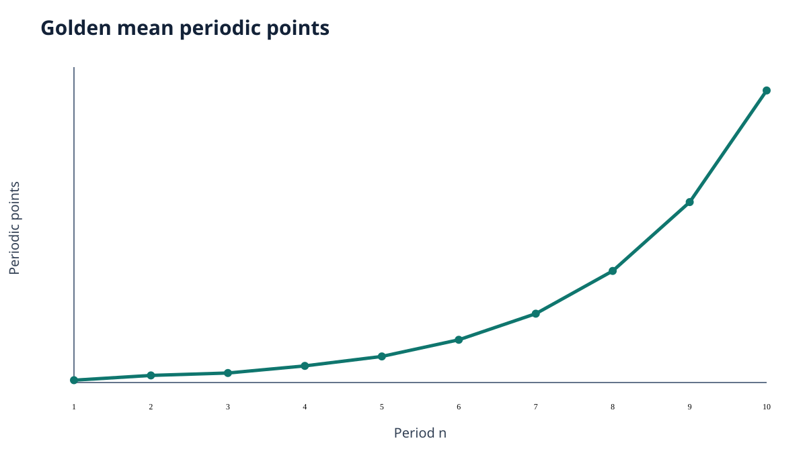
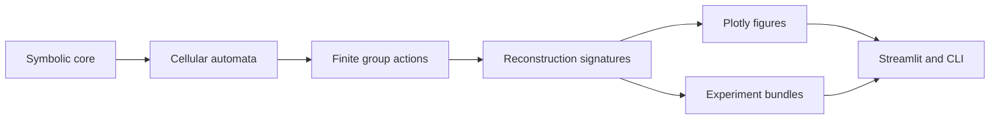

# Rubin Subshift Laboratory

[](https://www.python.org/)
[](https://github.com/bibymaths/rubin-subshift-lab/actions/workflows/ci.yml)
[](https://bibymaths.github.io/rubin-subshift-lab/)
[](#quality)
[](LICENSE)

**Rubin Subshift Laboratory: Computational Reconstruction of Symbolic Dynamical Systems from Automorphism Groups** is a finite computational laboratory for symbolic dynamics, one-dimensional cellular automata, finite permutation images, and Rubin-inspired reconstruction experiments.

> [!IMPORTANT]
> The software produces exact statements about declared finite domains and bounded evidence about larger systems. It does not claim that finite experiments prove Rubin's theorem for infinite subshifts.

## What the laboratory provides

- Exact finite alphabets, words, periodic configurations, forbidden languages, and one-step SFTs.
- Sliding block codes, elementary cellular automata, periodic simulations, and finite transition maps.
- Exact finite-quotient bijectivity analysis and bounded inverse-rule searches.
- Immutable permutations, generated finite groups, orbits, stabilizers, and GAP export.
- Reproducible finite reconstruction signatures and structured comparisons.
- Plotly figures with HTML, SVG, PNG, and PDF export where Kaleido is available.
- A multipage Streamlit application, Typer CLI, tests, Zensical documentation, and CI.

## Example output



The figure is generated deterministically by `scripts/export_example_figures.py`. Interactive HTML and Kaleido-backed static exports use the same Plotly figure factory.

## Quick start

```bash
git clone https://github.com/bibymaths/rubin-subshift-lab.git
cd rubin-subshift-lab
uv sync --all-groups
uv run streamlit run src/rubin_subshifts/app/streamlit_app.py
```

The application opens at <http://localhost:8501> and exposes the Subshift Designer, Cellular Automata Explorer, Reversibility Laboratory, Automorphism Group Explorer, Reconstruction Laboratory, Experiment Runner, and Figure Gallery.

## Command line

```bash
uv run rubin-subshift --help
uv run rubin-subshift examples list
uv run rubin-subshift subshift analyze --model golden-mean --max-period 10
uv run rubin-subshift ca simulate --rule 110 --initial 00010000 --steps 24
uv run rubin-subshift ca finite-reversibility --rule 110 --period 8 --json
uv run rubin-subshift ca inverse-search --automaton left-shift
uv run rubin-subshift group explore --period 6
uv run rubin-subshift reconstruction compare --max-period 10
uv run rubin-subshift validate
```

## Python example

```python
from rubin_subshifts.symbolic.sft import OneStepSFT

golden_mean = OneStepSFT.golden_mean()
assert [golden_mean.periodic_point_count(n) for n in range(1, 6)] == [1, 3, 4, 7, 11]
```

## Architecture

The package deliberately separates exact mathematics from presentation:



Core algorithms do not import Streamlit. Every public analysis result declares an `AlgorithmicGuarantee` so exact finite statements remain visibly distinct from bounded, heuristic, or experimental evidence.

## Documentation

```bash
uv run zensical serve
uv run zensical build --clean --strict
```

## Quality

```bash
uv run ruff check .
uv run ruff format --check .
uv run mypy src
uv run pytest --cov=rubin_subshifts --cov-branch --cov-fail-under=90
uv run zensical build --clean --strict
uv build
```

Static exports require Kaleido's runtime dependencies. GAP and SageMath are optional external tools and are never installed as ordinary PyPI dependencies.

## Project status

The project is research-grade alpha software. APIs are typed and tested, but reconstruction signatures remain experimental finite proxies. See the [algorithmic guarantees](docs/reference/algorithmic-guarantees.md) before interpreting results.

## Contributing and citation

See [CONTRIBUTING.md](CONTRIBUTING.md). Cite the project using [CITATION.cff](CITATION.cff).

## License

MIT. See [LICENSE](LICENSE).
