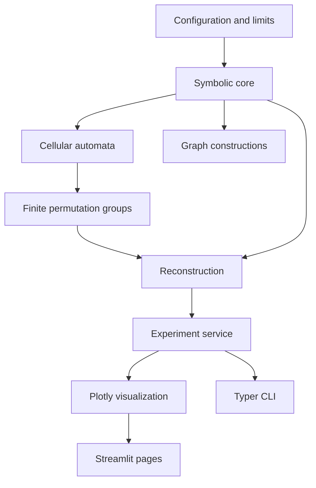

# Architecture

The dependency direction runs from exact domain objects toward presentation layers.

Immutable dataclasses represent mathematical objects; Pydantic validates user-facing configuration; pure functions perform transformations. Streamlit imports the service layer, never the reverse.

