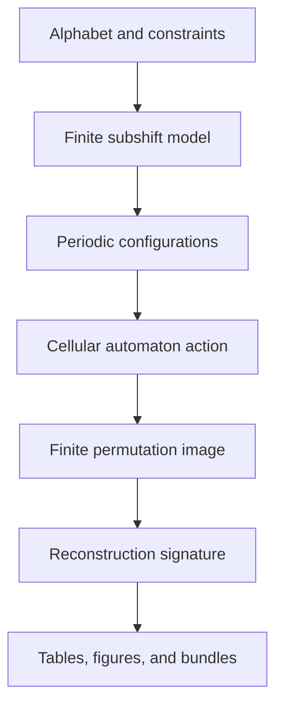

# Rubin Subshift Laboratory

Rubin Subshift Laboratory is a research environment for exact finite experiments in symbolic dynamics, cellular automata, finite permutation actions, and reconstruction signatures inspired by Rubin's theorem.

!!! warning "Scope"
    A finite computation can distinguish examples, reveal collisions, and support conjectures. It cannot by itself prove a statement about an infinite shift space or its full automorphism group.

## From mathematical input to evidence

Every analysis result carries a guarantee label. Exact finite statements are separated from exhaustive bounded searches, heuristics, experiments, and any future proof-grade algorithm.

## Start here

- [Install and launch](getting-started.md)
- [Understand the guarantees](reference/algorithmic-guarantees.md)
- [Use the Streamlit laboratories](user-guide/streamlit-app.md)
- [Run reproducible CLI experiments](user-guide/command-line-interface.md)
- [Read the architecture](development/architecture.md)

