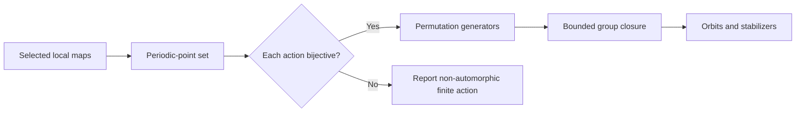

# Automorphism groups

An automorphism of a subshift is an invertible sliding block code from the subshift to itself. The full automorphism group is generally infinite and is not enumerated here.

The laboratory restricts selected automorphisms to finite periodic-point sets. When the restriction is bijective, it becomes an immutable permutation. Generator closure, orbit decomposition, stabilizers, cycle types, and Cayley graphs are then exact for that finite representation.

