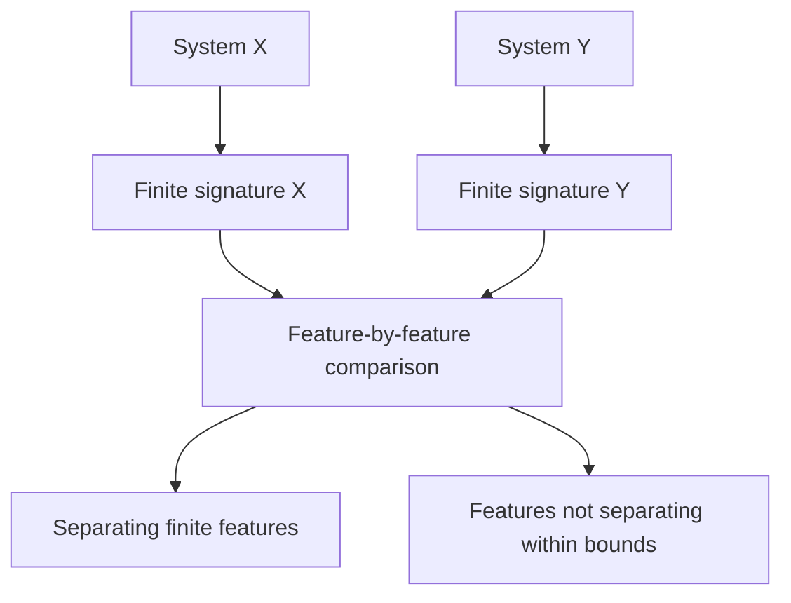

# Rubin-inspired reconstruction

Rubin-type reconstruction theorems ask when an abstract transformation group remembers the space on which it acts. This laboratory does not implement a proof of such a theorem. It asks a bounded experimental question instead: which selected dynamical systems are distinguished by selected finite action invariants?

A match means only “not distinguished within the tested bounds.” A difference means “distinguished by the selected finite invariants.” Neither statement is silently promoted to an infinite-space theorem.

