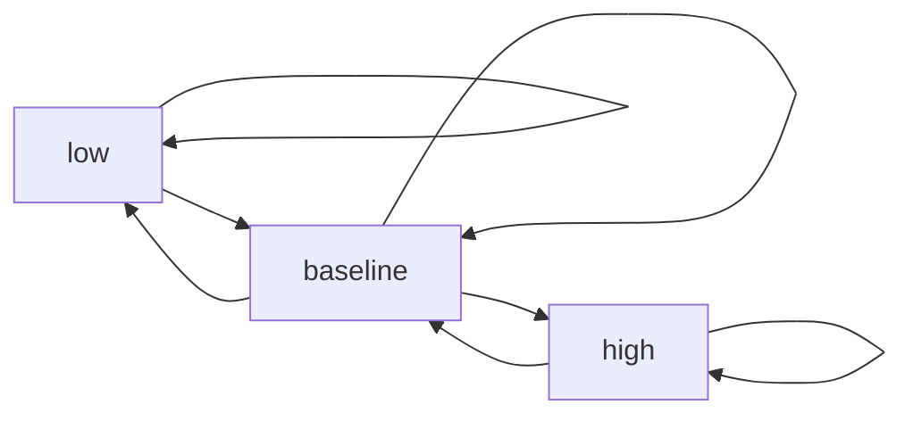

# Biological response model

This worked example converts already-discretized replicate ERK-response trajectories into a
finite symbolic transition model. It then computes periodic-point and least-period
features with the current public API.

The runnable source is `examples/response_model.py`.

!!! warning "Model evidence, not biological truth"
`EXACT_FINITE` means that the reported counts are exact for the inferred finite
transition matrix. It does not mean that discretization, transition inference, or
the biological model is exact.

## Run the example

From the repository root:

```bash
uv run python examples/response_model.py
```

The example uses only the public [symbolic API](../api/symbolic.md) and
[reconstruction API](../api/reconstruction.md).

## Input

The input consists of four hypothetical replicate trajectories. Measurements are
assumed to have already been normalized and classified as `low`, `baseline`, or
`high`.

| Replicate | $t_0$ | $t_1$ | $t_2$ | $t_3$ | $t_4$ | $t_5$ |
| --- | --- | --- | --- | --- | --- | --- |
| 1 | baseline | high | high | baseline | low | low |
| 2 | baseline | high | baseline | low | low | baseline |
| 3 | baseline | baseline | high | baseline | low | baseline |
| 4 | baseline | high | high | baseline | baseline | low |

This is deliberately more defensible than constructing a transition model from one
trajectory. In particular, a state observed only at the final time point provides no
evidence about its outgoing transitions.

## Transition inference

For each adjacent pair of time points, the script records:

- the total number of observed occurrences;
- the number of distinct replicates containing the transition;
- whether the transition meets the minimum support of two replicates.

| Source | Target | Occurrences | Replicate support | Allowed |
| --- | --- | ---: | ---: | --- |
| low | low | 2 | 2 | yes |
| low | baseline | 2 | 2 | yes |
| baseline | low | 4 | 4 | yes |
| baseline | baseline | 2 | 2 | yes |
| baseline | high | 4 | 4 | yes |
| high | baseline | 4 | 4 | yes |
| high | high | 2 | 2 | yes |

No replicate contains a direct `low → high` or `high → low` transition. With rows as
sources and columns as targets in the order `low`, `baseline`, `high`, the inferred
matrix is

$$
A=
\begin{pmatrix}
1 & 1 & 0 \\
1 & 1 & 1 \\
0 & 1 & 1
\end{pmatrix}.
$$



The graph records possible transitions, not transition probabilities. A permitted
edge does not become more important when it is observed more frequently.

## Building the model

The core API usage is:

```python
from rubin_subshifts.reconstruction import build_signature
from rubin_subshifts.symbolic import Alphabet, OneStepSFT

model = OneStepSFT.from_matrix(
    Alphabet(("low", "baseline", "high")),
    adjacency,
    name="ERK response model",
)

signature = build_signature(model, periods=(1, 2, 3, 4, 5, 6))
```

The complete script adds input validation, replicate-support counting, stable JSON
output, and explicit interpretation metadata.

## Expected results

The relevant part of the JSON output is:

```json
{
  "model": "ERK response model",
  "alphabet": ["low", "baseline", "high"],
  "replicates": 4,
  "minimum_replicate_support": 2,
  "adjacency": [
    [1, 1, 0],
    [1, 1, 1],
    [0, 1, 1]
  ],
  "periods": [1, 2, 3, 4, 5, 6],
  "periodic_point_count": [3, 7, 15, 35, 83, 199],
  "least_period_count": [3, 4, 12, 28, 80, 180],
  "least_period_orbit_count": [3, 2, 4, 7, 16, 30],
  "guarantee": "exact_finite"
}
```

The script also reports the complete transition-evidence table shown above.

## Meaning of the results

For a one-step shift of finite type, the period-$n$ count is

$$
P_n=\operatorname{tr}(A^n).
$$

It counts closed state sequences of length $n$ permitted by the inferred graph. It
does **not** count how many cycles were observed in the four input trajectories.

The least-period count removes configurations that already repeat with a smaller
period:

$$
E_n=P_n-\sum_{\substack{d\mid n\\d<n}}E_d.
$$

Each least-period-$n$ orbit contains $n$ phase-shifted configurations, so the orbit
count is

$$
O_n=\frac{E_n}{n}.
$$

| Period $n$ | Periodic points $P_n$ | Least-period points $E_n$ | Orbits $O_n$ |
| ---: | ---: | ---: | ---: |
| 1 | 3 | 3 | 3 |
| 2 | 7 | 4 | 2 |
| 3 | 15 | 12 | 4 |
| 4 | 35 | 28 | 7 |
| 5 | 83 | 80 | 16 |
| 6 | 199 | 180 | 30 |

At period 1, the three self-loops `low → low`, `baseline → baseline`, and
`high → high` give three fixed points. At period 2, four configurations have least
period 2: the two phases of the `low ↔ baseline` cycle and the two phases of the
`baseline ↔ high` cycle. Dividing four points by two phases gives two orbits.

Increasing counts indicate that the transition graph permits many longer closed
state programs. They are a combinatorial property of the model, not a measure of
ERK abundance, effect size, uncertainty, or biological fitness.

## Adapting the example

For real data:

1. normalize measurements and correct batch effects;
2. discretize using biologically justified thresholds and uncertainty;
3. pool adjacent transitions separately for each condition;
4. require replicate support or bootstrap stability;
5. build one `OneStepSFT` and signature per condition;
6. compare signatures over identical periods.

```python
from rubin_subshifts.reconstruction import compare_signatures

comparison = compare_signatures(control_signature, treated_signature)
```

A differing finite invariant separates the fitted transition models. Matching finite
signatures do not establish biological equivalence.

## Limitations

- The script starts from discrete states; it does not normalize or discretize raw
  measurements.
- Temporal samples are treated as ordered discrete steps. Unequal intervals require
  separate handling.
- Missing transitions are evidence-limited, not automatically impossible.
- The SFT records possible transitions, not their probabilities.
- The model is descriptive and does not infer causal regulation.
- Periodic points are model-supported closed paths, not necessarily observed
  biological oscillations.

## Related documentation

- [Subshift mathematics](../mathematical-background/subshifts.md)
- [Rubin-inspired reconstruction](../mathematical-background/rubin-reconstruction.md)
- [Symbolic API](../api/symbolic.md)
- [Reconstruction API](../api/reconstruction.md)
- [Algorithmic guarantees](../reference/algorithmic-guarantees.md)